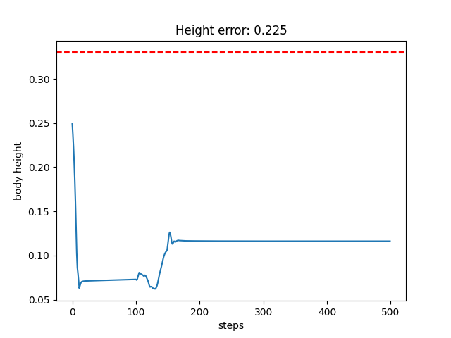
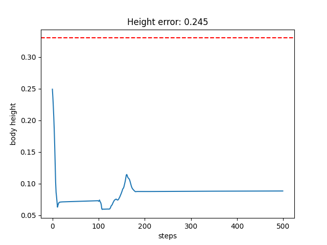
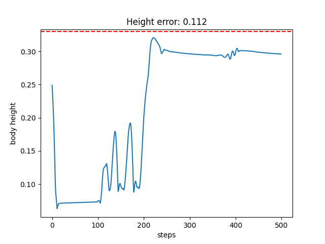
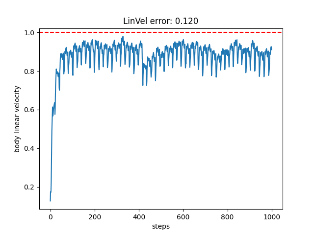
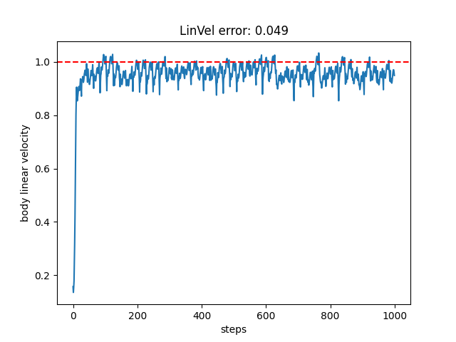

# 调参记录

## Part 2

### (1) 初始值

```py
        # body height
        height_err = body_pos[2] - DESIRED_BODY_HEIGHT
        r_height = jp.exp(-5.0 * height_err**2)

        # body orientation
        ori_cos = jp.dot(up_vec, gravity_vector / (jp.linalg.norm(gravity_vector) + 1e-6))
        r_ori = (ori_cos + 1.0) * 0.5

        # joint position (error to default pose)
        joint_err = joint_qpos - default_qpos
        r_joint_pos = jp.exp(-1.0 * jp.sum(joint_err**2))

        # body angular velocity (error to zero)
        r_ang_vel = jp.exp(-0.1 * jp.sum(body_ang_vel**2))

        # weighted sum
        reward = (
            1.0 * r_height +
            1.0 * r_ori +
            0.5 * r_joint_pos +
            0.2 * r_ang_vel
        )
```



### (2) 将 `r_height` 的权重调至 `2.0`



### (3) 将 `r_height` 的高斯系数调至 `20.0`；四项权重为 `3.0, 0.4, 0.3, 0.1`

通过 :white_check_mark:



## Part 3

### (1) 初始值

```py
        lin_vel_err = body_lin_vel[:2] - DESIRED_XY_LIN_VEL
        tracking_lin_vel = jp.exp(-0.5 * jp.sum(lin_vel_err**2))

        ang_val_err = body_ang_vel[2] - DESIRED_YAW_ANG_VEL
        tracking_ang_vel = jp.exp(-1.0 * ang_val_err**2)
```

通过 :white_check_mark:，但是感觉不太稳定



### (2) 将 `tracking_lin_vel` 的高斯系数调为 `2.0`

更好了 :blush:

